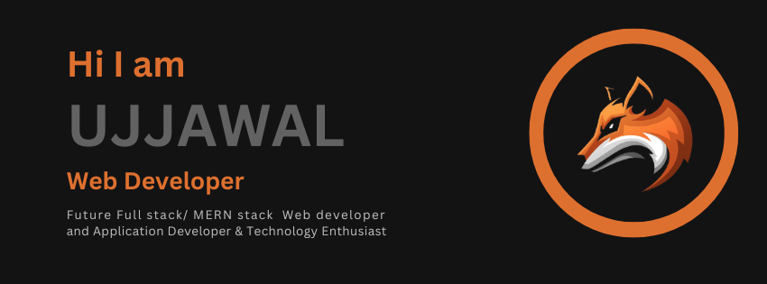

### Hey Ujjwal here 👋

---

  

I am a Front-End Web Developer who is exploring Full Stack Web Developement while facilitating the world with User Experience with my Design Thinking Skills and Enthusiast about application Developement 😉 
 
 🔭 I’m planning for a ** Full Stack Website with advanced concepts **.
 
 🌱 I’m currently learning  MERN Stack
 
 :books: I want to learn  and 
 
 👯 I’m looking to collaborate for a **Front-End** project.
 
 🤔 I’m looking for help with Backend Apps.
 
 💬 Ask me about Front-End Development, and any Tech-related stuff.

  

### Tech & Tools Preference

	

### You can find in me in the web 🌍

  

 

